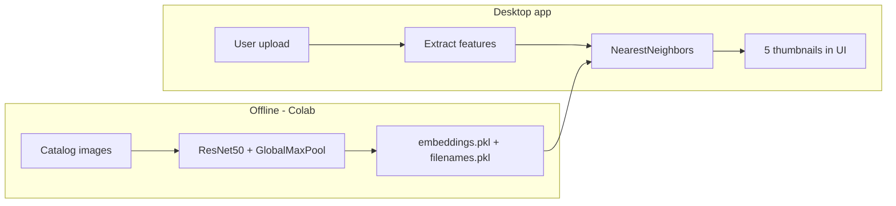

<p align="center">
  
</p>

<h1 align="center">Visual Recommender System</h1>

<p align="center">
  <strong>A CNN-Based Universal Visual Product Recommender System</strong><br/>
  CT-527 Image Processing and Computer Vision — Course Project
</p>

<p align="center">
  Kumail Ali Shaikh (CT-053 2024/25) · Saifullah Siddiqui (CT-031 2024/25)
</p>

---

## Overview

The **Visual Recommender System** is a desktop application that recommends visually similar fashion products from a large image catalog. A user uploads a single product photo; the system encodes it with a pretrained **ResNet50** network, searches a precomputed embedding index with **nearest-neighbor retrieval**, and displays the top five matches in a GUI.

## How it works



1. **Indexing (once):** Each catalog image is resized to 224×224, passed through frozen ResNet50, globally max-pooled to a 2048-D vector, and L2-normalized. Vectors are stored in `data/files/embeddings.pkl` with paths in `data/files/filenames.pkl`.
2. **Query:** The uploaded image goes through the same encoder.
3. **Search:** scikit-learn `NearestNeighbors` (Euclidean distance, brute force) finds close catalog vectors.
4. **Display:** The five best matches (excluding the query file if it is already in the catalog) are shown in the Similar Products section.

## Prerequisites

| Requirement | Notes |
|-------------|--------|
| **Python 3.12** (recommended) | TensorFlow does not support Python 3.14 yet |
| **Tcl/Tk (tkinter)** | Required for CustomTkinter; enable “tcl/tk” when installing Python on Windows |
| **Disk space** | ~2 GB for TensorFlow; catalog images and pickle index |
| **Precomputed index** | `data/files/embeddings.pkl` and `data/files/filenames.pkl` |
| **Dataset images** | `data/dataset/images/` (paths in the pickle are relative, e.g. `images\10000.jpg`) |

## Installation

### 1. Clone or download the project

```bash
cd ipcv-project
```

### 2. Create a virtual environment (Python 3.12)

**Windows (PowerShell):**

```powershell
py -3.12 -m venv .venv
.\.venv\Scripts\Activate.ps1
python -m pip install --upgrade pip
pip install -r requirements.txt
```

**macOS / Linux:**

```bash
python3.12 -m venv .venv
source .venv/bin/activate
python -m pip install --upgrade pip
pip install -r requirements.txt
```

If you upgraded Python or the old venv is broken, delete the `.venv` folder and recreate it with the commands above.

### 3. Verify tkinter

```bash
python -c "import tkinter; print('tkinter OK')"
```

If this fails on Windows, rerun the [Python 3.12 installer](https://www.python.org/downloads/) and enable **tcl/tk and IDLE**, then recreate the venv.

### 4. Verify the recommendation index (optional)

```bash
python scripts/test_recommendation.py
```

Expect `index load: PASSED` and, after TensorFlow loads ResNet50 weights on first run, `recommend in-dataset: PASSED`.

## Running the application

```bash
python run.py
```

**First run:** ResNet50 ImageNet weights download automatically; the first upload may take several seconds on CPU.

### Typical demo flow

1. Start the app and wait for background index load logs.
2. Click **Upload** and choose an image (e.g. `data/dataset/images/10000.jpg`).
3. Review five similar products and console `Rank N: … (euclidean distance=…) ` lines.
4. Click **Clear** to reset.


## Tech stack

| Layer | Technology |
|-------|------------|
| Desktop UI | [CustomTkinter](https://github.com/TomSchimansky/CustomTkinter) |
| Image I/O | Pillow |
| Deep learning | TensorFlow / Keras (ResNet50) |
| Similarity search | NumPy, scikit-learn (`NearestNeighbors`) |
| Index storage | pickle |
| Batch indexing | Google Colab (see notebook) |

## Dependencies

Listed in [`requirements.txt`](requirements.txt):

- `customtkinter>=5.2.2`
- `Pillow>=10.0.0`
- `numpy>=1.26.0`
- `scikit-learn>=1.4.0`
- `tensorflow>=2.15.0`

## Troubleshooting

| Issue | Solution |
|-------|----------|
| `No module named 'tkinter'` | Install Python 3.12 with Tcl/Tk enabled; recreate `.venv` |
| `No matching distribution found for tensorflow` | Use Python 3.11 or 3.12, not 3.14 |
| `Missing embeddings.pkl` | Run indexing in Colab or copy `data/files/` from project release |
| `Recommendation error` on upload | Check console logs; ensure `data/dataset/images/` paths match `filenames.pkl` |
| Slow first recommendation | Normal on CPU—model weights load once; later queries are faster |
| GPU warning on Windows | TensorFlow 2.11+ uses CPU on native Windows; expected for this project |

## Regenerating embeddings

To rebuild `embeddings.pkl` and `filenames.pkl` after changing the catalog:

1. Open [`training/notebook.ipynb`](training/notebook.ipynb) in Google Colab.
2. Point the dataset path to your image folder.
3. Run all cells to extract features and save pickles into `data/files/`.
4. Copy the updated pickles and images into this project’s `data/` tree.

The desktop app does not re-index locally; it only loads precomputed files.

## License and academic use

This repository was developed for **CT-527 Image Processing and Computer Vision**. Dataset and model weights are subject to their respective licenses (ImageNet weights via TensorFlow/Keras, catalog images as provided for the course).

---

<p align="center">
  <sub>Visual Recommender System · CT-527 · 2024/25</sub>
</p>
